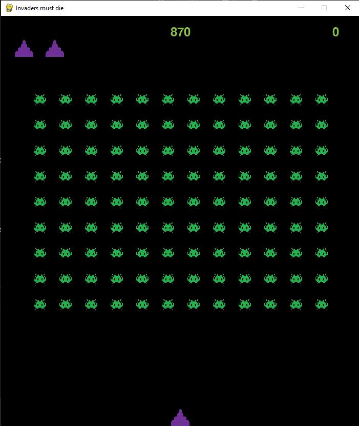

# 🚀 Space Invaders

Классическая аркадная игра Space Invaders (в моем случае немного переименованная, в честь трека группы The Prodigy), написанная на Python с использованием библиотеки Pygame.

 

## 🎮 Описание игры

Space Invaders - это культовая аркадная игра, где игрок управляет космическим кораблём, который должен уничтожить волны наступающих инопланетян. С каждым уровнем сложность увеличивается, а пришельцы движутся быстрее!

### Основные особенности:
- ✨ Классический геймплей в стиле ретро-аркады
- ⭐ Система подсчёта очков и рекордов
- 🎨 Пиксель-арт графика

## 🛠️ Установка и запуск

### Предварительные требования
- Python 3.13
- Pip (менеджер пакетов Python)

### Установка зависимостей

```bash
# Клонируйте репозиторий
git clone https://github.com/b221b/invaders_must_die.git
cd space-invaders
```

### Запуск игры

```bash
# Основной способ запуска
python invaders_game.py
```

## 🎯 Управление

- **A D** - Движение влево/вправо
- **ПРОБЕЛ** - Стрельба

<!-- ## 📁 Структура проекта

```
space-invaders/
├── assets/                 # Ресурсы игры
│   ├── images/            # Графика и спрайты
│   │   ├── player.png     # Корабль игрока
│   │   ├── aliens/        # Пришельцы
│   │   ├── bullets/       // Снаряды
│   │   └── background.png // Фон
│   ├── sounds/            # Звуковые эффекты
│   │   ├── shoot.wav      // Звук выстрела
│   │   ├── explosion.wav  // Взрыв
│   │   └── background.mp3 // Фоновая музыка
│   └── fonts/             # Шрифты
├── src/                   # Исходный код
│   ├── main.py           # Главный файл игры
│   ├── game.py           // Логика игры
│   ├── player.py         // Класс игрока
│   ├── alien.py          // Класс пришельцев
│   ├── bullet.py         // Класс снарядов
│   └── menu.py           // Меню и интерфейс
├── requirements.txt       # Зависимости Python
├── config.json           // Настройки игры
└── README.md             # Этот файл
``` -->

<!-- ## 🎨 Кастомизация

Вы можете легко настроить игру, изменив файл `config.json`:

```json
{
    "game": {
        "screen_width": 800,
        "screen_height": 600,
        "fps": 60
    },
    "player": {
        "speed": 5,
        "lives": 3
    },
    "aliens": {
        "rows": 5,
        "cols": 11,
        "speed": 1
    }
}
``` -->

## 📝 To-Do список

- [ ] Добавить паузу
- [ ] Добавить музыку
- [ ] Добавить боссов
- [ ] Реализовать магазин с апгрейдами
- [ ] Добавить достижения

---

**Да прибудут с вами высокие частоты!** 🎯